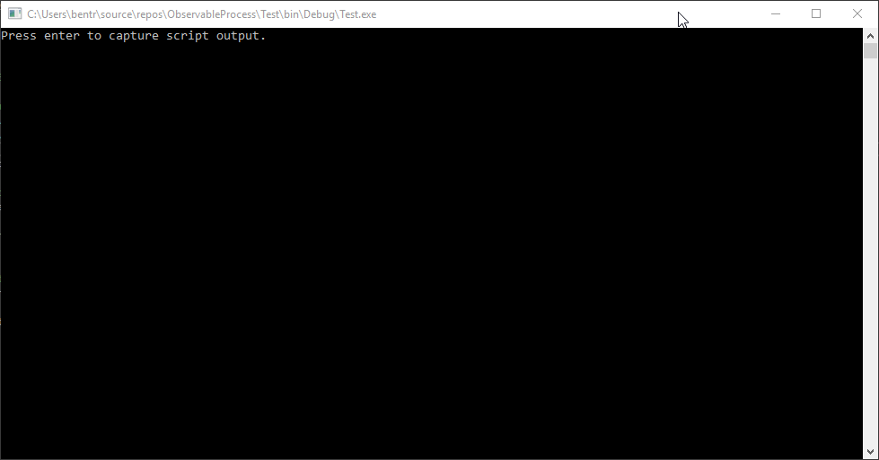

# ObservableProcess
Observable abstraction for processes for .NET. Treat your executable or script processes as a push 
stream of information (IObservable). Written in C#.

## Details
ObservableProcess makes it possible to listen to processes like any other event source (IObservable). 
The initial version captures output and error messages as well as exited and disposed events as observable
signals using the same observable. It is possible to observe both executables, console applications as well
as certain other files like .sln files.



##Usage
```csharp
var observable = ProcessObservable.TryCreateFromFile("LoremIpsum.exe");
```
