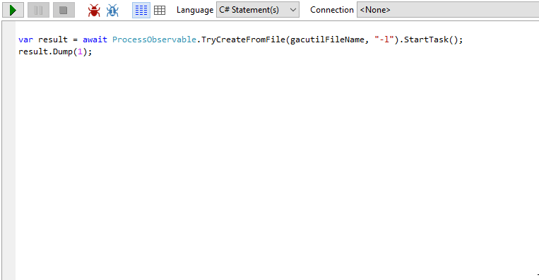
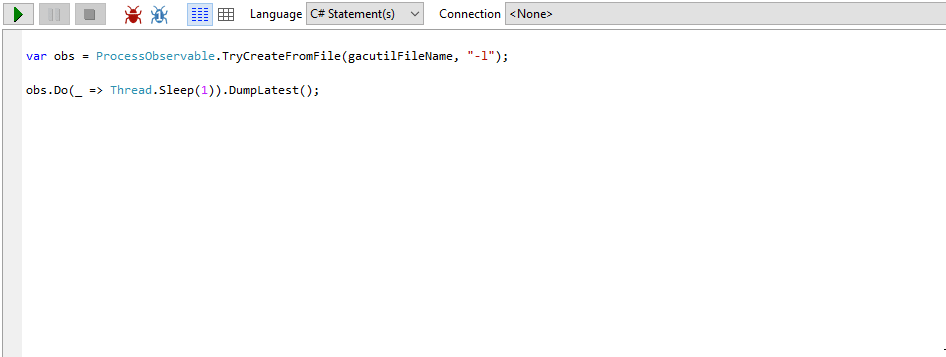

# ProcessObservable

Observable abstraction for processes for .NET. Treat your executable or script process as a push 
stream of information (IObservable<ProcessSignal>) or a task (Task<ProcessCompletion>). Both
executable files, scripts and other file types (with associated programs) can be observed or 
awaited asynchronously.

## Task syntax

The simplest use is using async/await syntax:

```csharp
var result = await ProcessObservable.TryCreateFromFile("LoremIpsum.exe").StartTask();
// ...
```




## Observable syntax

A more streaming API is by observing the process as it happens, by creating an IObservable<ProcessSignal>:

```csharp
var observable = ProcessObservable.TryCreateFromFile("LoremIpsum.exe");
// ...
```



## NuGet

ObservableProcess is available as a NuGet package:
https://www.nuget.org/packages/Exoteric-ObservableProcess
